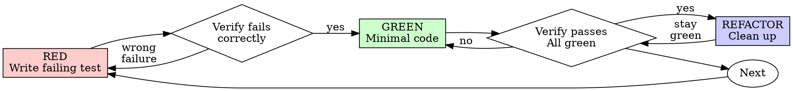

# Test-Driven Development (TDD)

## Overview

Write the test first. Watch it fail. Write minimal code to pass.

**Core principle:** If you didn't watch the test fail, you don't know if it tests the right thing.

**Violating the letter of the rules is violating the spirit of the rules.**

This skill is language-agnostic. Wherever it says "test runner", use your stack's tool (Jest, pytest, RSpec, go test, JUnit, cargo test, …). Wherever it shows pseudocode, translate to your language's testing idiom.

## When to Use

**Always:**

- New features
- Bug fixes
- Refactoring
- Behavior changes

**Exceptions (ask your human partner):**

- Throwaway prototypes
- Generated code (scaffolds you immediately rewrite)
- Configuration files

Thinking "skip TDD just this once"? Stop. That's rationalization.

## The Iron Law

```
NO PRODUCTION CODE WITHOUT A FAILING TEST FIRST
```

Write code before the test? Delete it. Start over.

**No exceptions:**

- Don't keep it as "reference"
- Don't "adapt" it while writing tests
- Don't look at it
- Delete means delete

Implement fresh from the tests. Period.

## Red-Green-Refactor



### RED - Write Failing Test

Write one minimal test showing what should happen.

<Good>
```
test "retries failed operations up to 3 times":
    attempts = 0
    operation = () => {
        attempts += 1
        if attempts < 3: throw Error("fail")
        return "success"
    }

    result = retry(operation)

    assert result == "success"
    assert attempts == 3
```
Clear name, tests real behavior through the public API, one thing
</Good>

<Bad>
```
test "retry works":
    operation = mock()
    operation.stub_to_fail_twice_then_return("success")

    retry(operation)

    assert operation.was_called(3)   // only proves the mock was called
```
Vague name, tests the mock not the code
</Bad>

**Requirements:**

- One behavior per test
- Clear name that describes the behavior
- Real code and real collaborators (no mocks/stubs unless unavoidable)

### Verify RED - Watch It Fail

**MANDATORY. Never skip.**

Run the single new test with your test runner:

```bash
<test-runner> path/to/the_new_test    # e.g. pytest tests/test_retry.py, npx jest retry.test.ts
```

Confirm:

- Test fails (not errors)
- Failure message is the one you expected
- It fails because the feature is missing (not a typo, import error, or broken setup)

**Test passes?** You're testing existing behavior. Fix the test.

**Test errors?** Distinguish the two kinds: "the function/class doesn't exist yet" IS the expected first failure — that's fine. A syntax error or broken test setup is not. Fix the error, re-run until it fails correctly on the assertion.

### GREEN - Minimal Code

Write the simplest code to pass the test.

<Good>
```
function retry(operation):
    for attempt in 1..3:
        try:
            return operation()
        catch error:
            if attempt == 3: rethrow
```
Just enough to pass
</Good>

<Bad>
```
function retry(operation, max_retries = 3, backoff = "exponential",
               on_retry = null, jitter = false):
    // YAGNI — options nobody asked for
```
Over-engineered
</Bad>

Don't add features, refactor other code, or "improve" beyond the test.

### Verify GREEN - Watch It Pass

**MANDATORY.**

Run the new test, then the whole suite.

Confirm:

- The new test passes
- All other tests still pass (run the full suite)
- Output pristine (no errors, no warnings, no leftover print/debug statements)

**Test fails?** Fix the code, not the test.

**Other tests fail?** Fix now.

### REFACTOR - Clean Up

After green only:

- Remove duplication
- Improve names
- Extract helpers / functions / modules

Keep tests green. Don't add behavior.

### Repeat

Next failing test for the next behavior.

## Good Tests

| Quality          | Good                                    | Bad                                               |
| ---------------- | --------------------------------------- | ------------------------------------------------- |
| **Minimal**      | One thing. "and" in the name? Split it. | `test "validates email and domain and whitespace"` |
| **Clear**        | Name describes behavior                 | `test "works"` / `test "test1"`                   |
| **Shows intent** | Demonstrates the desired public API     | Obscures what the code should do                  |

Structure tests as arrange → act → assert. Use your framework's grouping and shared-setup facilities (describe/context blocks, fixtures, setup hooks) — but keep each test asserting one behavior.

## Why Order Matters

**"I'll write tests after to verify it works"**

Tests written after code pass immediately. Passing immediately proves nothing:

- Might test the wrong thing
- Might test implementation, not behavior
- Might miss edge cases you forgot
- You never saw it catch the bug

Test-first forces you to see the test fail, proving it actually tests something.

**"I already manually tested all the edge cases"**

Manual testing is ad-hoc. You think you tested everything but:

- No record of what you tested
- Can't re-run when code changes
- Easy to forget cases under pressure
- "It worked in the console / on the page" ≠ comprehensive

Automated tests are systematic. The suite runs the same way every time.

**"Deleting X hours of work is wasteful"**

Sunk cost fallacy. The time is already gone. Your choice now:

- Delete and rewrite with TDD (X more hours, high confidence)
- Keep it and add tests after (30 min, low confidence, likely bugs)

The "waste" is keeping code you can't trust. Working code without real tests is technical debt.

**"TDD is dogmatic, being pragmatic means adapting"**

TDD IS pragmatic:

- Finds bugs before commit (faster than debugging after)
- Prevents regressions (tests catch breaks immediately)
- Documents behavior (tests show how to use the code)
- Enables refactoring (change freely, tests catch breaks)

"Pragmatic" shortcuts = debugging in production = slower.

**"Tests after achieve the same goals - it's spirit not ritual"**

No. Tests-after answer "What does this do?" Tests-first answer "What should this do?"

Tests-after are biased by your implementation. You test what you built, not what's required. You verify remembered edge cases, not discovered ones.

Tests-first force edge case discovery before implementing. Tests-after verify you remembered everything (you didn't).

30 minutes of tests after ≠ TDD. You get coverage, lose proof the tests work.

## Common Rationalizations

| Excuse                                  | Reality                                                                  |
| --------------------------------------- | ------------------------------------------------------------------------ |
| "Too simple to test"                    | Simple code breaks. The test takes 30 seconds.                           |
| "I'll test after"                       | Tests passing immediately prove nothing.                                 |
| "Tests after achieve same goals"        | Tests-after = "what does this do?" Tests-first = "what should this do?"  |
| "Already manually tested"               | Ad-hoc ≠ systematic. No record, can't re-run.                            |
| "Deleting X hours is wasteful"          | Sunk cost fallacy. Keeping unverified code is technical debt.            |
| "Keep as reference, write tests first"  | You'll adapt it. That's testing after. Delete means delete.              |
| "Need to explore first"                 | Fine. Throw away the spike, start with TDD.                              |
| "Test hard to write = skip it"          | Listen to the test. Hard to test = hard to use. Fix the design.          |
| "TDD will slow me down"                 | TDD is faster than debugging. Pragmatic = test-first.                    |
| "Manual test faster"                    | Manual doesn't prove edge cases. You'll re-test every change.            |
| "Existing code has no tests"            | You're improving it. Add tests for existing code.                        |

## Red Flags - STOP and Start Over

- Code before test
- Test after implementation
- Test passes immediately
- Can't explain why the test failed
- Tests added "later"
- Rationalizing "just this once"
- "I already manually tested it"
- "Tests after achieve the same purpose"
- "It's about spirit not ritual"
- "Keep as reference" or "adapt existing code"
- "Already spent X hours, deleting is wasteful"
- "TDD is dogmatic, I'm being pragmatic"
- "This is different because..."

**All of these mean: Delete code. Start over with TDD.**

## Example: Bug Fix

**Bug:** Empty email accepted at registration

**RED**

```
test "rejects an empty email":
    response = POST /registrations, { email: "" }

    assert response.status == 422
    assert response.errors mention "email"
```

**Verify RED**

```
$ <test-runner> registrations_test
FAIL: expected status 422, got 200
```

**GREEN**

Add the validation — and only the validation:

```
function register(input):
    if input.email is blank:
        return validation_error("email is required")
    ...
```

**Verify GREEN**

```
$ <test-runner> registrations_test
PASS (1 test, 0 failures)
```

**REFACTOR**
Extract shared validation logic if multiple fields need it. Stay green.

## Verification Checklist

Before marking work complete:

- [ ] Every new code path has a test
- [ ] Watched each test fail before implementing
- [ ] Each test failed for the expected reason (behavior missing, not a typo)
- [ ] Wrote minimal code to pass each test
- [ ] Full test suite is GREEN
- [ ] Output pristine (no errors, no warnings, no stray print/debug statements)
- [ ] Tests use real code (real objects and data; mocks/stubs only at external boundaries)
- [ ] Edge cases and errors covered

Can't check all boxes? You skipped TDD. Start over.

## Choosing the Test Layer

Match the test to the behavior — do not prove everything through end-to-end tests, and do not prove integration behavior with unit tests.

- **Unit tests** — pure logic, validations, invariants, data transformations. Fast, isolated, no I/O. The default home for most TDD cycles.
- **Integration / API tests** — behavior that crosses component boundaries: HTTP endpoints (status codes, response contract, authorization), database interactions, module wiring.
- **End-to-end / UI tests** — full user journeys through the running system in a real client/browser. Few, high-value flows only; everything provable at a lower layer belongs at that lower layer. Select UI elements by stable test identifiers (e.g. `data-test` attributes), never by visible text or DOM position.

Build test data with your stack's factory/fixture/builder mechanism inside the test — never assume pre-existing state.

## When Stuck

| Problem                | Solution                                                                                |
| ---------------------- | --------------------------------------------------------------------------------------- |
| Don't know how to test | Write the wished-for public call. Write the assertion first. Ask your human partner.    |
| Test too complicated   | Design too complicated. Simplify the interface / extract a smaller unit.                |
| Must mock everything   | Code too coupled. Inject the dependency (pass the collaborator in) instead.             |
| Setup huge             | Extract factories / builders / setup helpers. Still complex? Simplify the design.       |

## Debugging Integration

Bug found? Write a failing test reproducing it. Follow the TDD cycle. The test proves the fix and prevents regression.

Never fix bugs without a test.

## Testing Anti-Patterns

When adding mocks, stubs, or test utilities, read [testing-anti-patterns.md](references/testing-anti-patterns.md) to avoid common pitfalls:

- Testing mock behavior instead of real behavior (asserting "was called" where a state assertion suffices)
- Adding test-only methods to production code
- Over-stubbing without understanding dependencies
- Leaky shared state between tests

## Final Rule

```
Production code → a test exists and failed first
Otherwise → not TDD
```

No exceptions without your human partner's permission.
