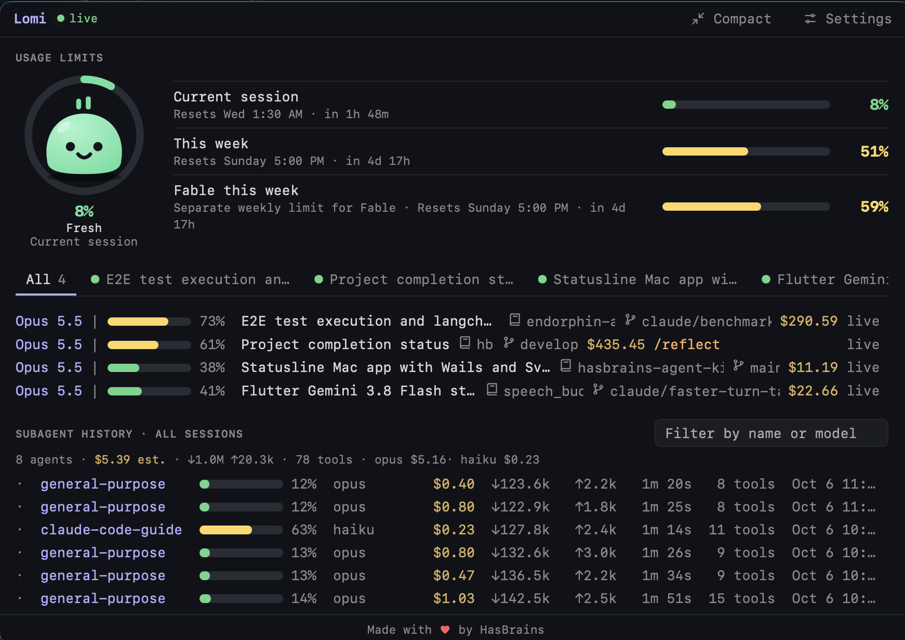

<p align="center"></p>

# Lomi

Lomi shows your Claude Code usage in the macOS menu bar: usage limits, every open session, subagents and cost.



## What you get

- **Usage limits**: current session, this week, and per-model limits such as "Fable this week", each with its reset time.
- **Sessions**: one row and one tab per open Claude Code session, with model, context %, cost, repository and branch.
- **Subagents**: model, context %, cost, tokens, duration and tool calls for each.
- **Lomi**: the character in the ring. Its mood goes from Fresh to Out of tokens as you use up the limit.

Lomi reads Claude Code's own files on your Mac. It does not change your sessions.

## Install

You need macOS 12 or later (Apple Silicon or Intel) and [Claude Code](https://claude.com/claude-code).

With [Homebrew](https://brew.sh):

```sh
brew install --cask endorphin-ai/tap/lomi
```

Without Homebrew:

```sh
curl -fsSL https://raw.githubusercontent.com/endorphin-ai/hasbrains-agent-kit/main/app/lomi/install.sh | sh
```

Both put Lomi in `/Applications`. Lomi is signed and notarized by Apple. You can also download `Lomi-macos-universal.zip` from [Releases](https://github.com/endorphin-ai/hasbrains-agent-kit/releases) by hand.

## Update

```sh
brew upgrade --cask lomi
```

Without Homebrew, run the `curl` install command again.

## Run

```sh
open /Applications/Lomi.app
```

Lomi has no Dock icon. Look for its face in the menu bar and click it.

## Verify

1. Click the Lomi icon. The window opens under the menu bar.
2. Open **Settings**. Click **Install bridge**, or **Set up the status line** if Claude Code has no status line yet. This gives Lomi live data: it adds one line to your status line script, or creates a small script for you. A backup is kept.
3. Send a message in any Claude Code session.
4. In a few seconds the session shows **live**, and the usage limits fill in. If it does not, open a new Claude Code session.


## Go

| To do this | Do this |
|---|---|
| See one session | Click its tab |
| See all sessions and recent subagents | Click **All** |
| Show limits only | Click **Compact** |
| Close the window | Press Escape or click elsewhere |
| Quit | Right-click the menu bar icon |

The number beside the menu bar icon is the used % of your session limit.

## Change

Everything is in **Settings**:

- **Per-model weekly limits**: turn "Fable this week" on or off. Read the note there first; this option uses your Claude login.
- **Panels**: show or hide limits, sessions, command run and subagents.
- **Display**: bar style, number of subagent rows, refresh interval, the character, animations.
- **Git**: show or hide repository, branch and worktree.
- **Prices**: USD per 1M tokens for each model. Lomi uses them to estimate subagent cost.
- **Thresholds**: when a bar turns yellow or red.

## Remove

```sh
curl -fsSL https://raw.githubusercontent.com/endorphin-ai/hasbrains-agent-kit/main/app/lomi/uninstall.sh | sh
```

This quits Lomi, deletes the app, its settings and saved data, and takes the bridge line out of your status line script. If Lomi created your status line, that small script stays; it only shows the model name.

By hand: quit Lomi (right-click its menu bar icon), then drag `Lomi.app` from the Applications folder to the Trash.

Made with ♥ by [HasBrains](https://hasbrains.com/).
